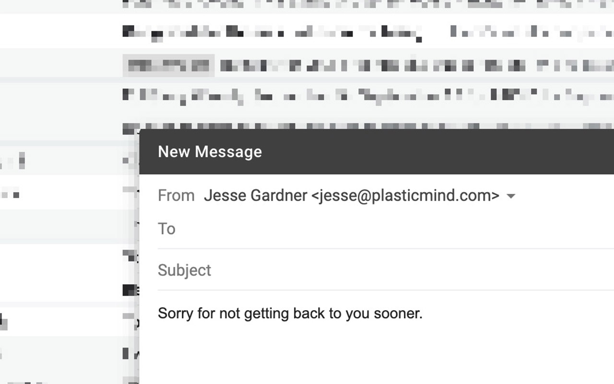
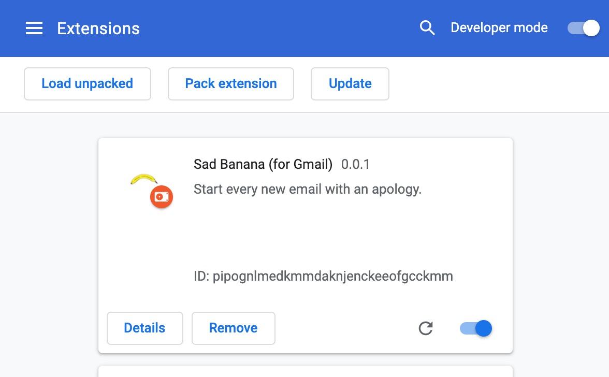

# Sad Banana Chrome Extension for Gmail

Adds "Sorry for not getting back to you sooner." to the beginning of every new email.

## Installation

Download the <a href="">extensions archive</a> and unzip it. Then, on Chrome's extension page, click "Load Unpacked" and select the unzipped folder.

Reload your Gmail tabs, and now every new email should bear the mark of your self-loating!

## Inspiration

<blockquote class="twitter-tweet">
I need a Gmail plugin that automatically starts every single email I reply to with &quot;Sorry for not getting back to you sooner.&quot;
&mdash; Marc Johns (@marcjohns) <a href="https://twitter.com/marcjohns/status/1173434159793967104?ref_src=twsrc%5Etfw">September 16, 2019</a></blockquote>